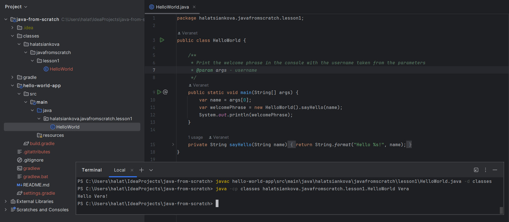

## Java From Scratch

#### Lesson 1
```shell
javac hello-world-app\src\main\java\halatsiankova\javafromscratch\lesson1\HelloWorld.java -d classes  
java -cp classes halatsiankova.javafromscratch.lesson1.HelloWorld Vera
```

#### Lesson 7
##### Tools
* Java 21
* Maven
* Gradle 8.+   

Build project using Maven
```shell
mvn clean package
```
Run application
```shell
java -jar bus-tickets/target/bus-tickets-1.0-SNAPSHOT-jar-with-dependencies.jar
```
Build project using Gradle
```shell
gradle clean build
```
Run application
```shell
java -jar bus-tickets/build/libs/bus-tickets-1.0-SNAPSHOT.jar
```